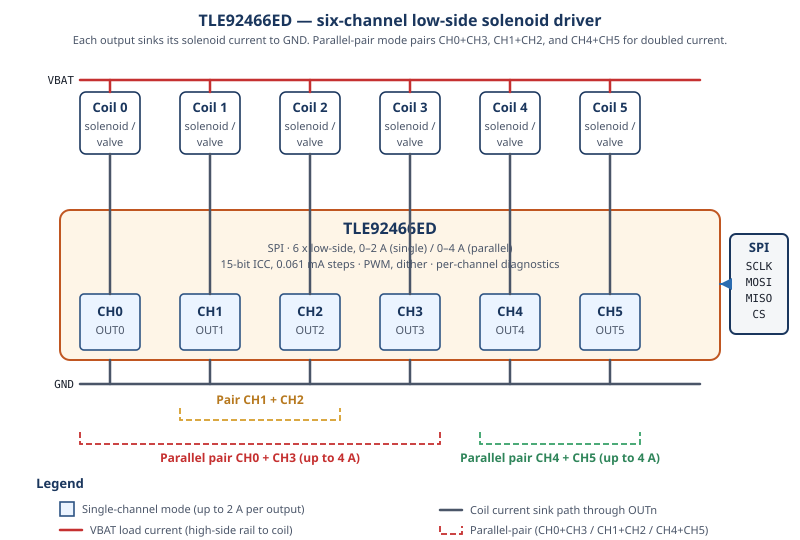

# HF-TLE92466ED Driver

**C++20 driver for Infineon TLE92466ED Six-Channel Low-Side Solenoid Driver IC**

[](https://en.cppreference.com/w/cpp/20)
[](https://www.gnu.org/licenses/gpl-3.0)
[](https://github.com/N3b3x/hf-tle92466ed-driver/actions/workflows/esp32-examples-build-ci.yml)
[](https://n3b3x.github.io/hf-tle92466ed-driver/)

## 📚 Table of Contents
1. [Overview](#-overview)
2. [Features](#-features)
3. [Quick Start](#-quick-start)
4. [Installation](#-installation)
5. [API Reference](#-api-reference)
6. [Examples](#-examples)
7. [Documentation](#-documentation)
8. [References](#-references)
9. [Contributing](#-contributing)
10. [License](#-license)

## 📦 Overview

> **📖 [📚🌐 Live Complete Documentation](https://n3b3x.github.io/hf-tle92466ed-driver/)** - 
> Interactive guides, examples, and step-by-step tutorials

**HF-TLE92466ED** is a modern C++20 driver for the **Infineon TLE92466ED** Six-Channel Low-Side Solenoid Driver IC. The TLE92466ED provides six independent low-side outputs for controlling solenoids, valves, and other inductive loads with precision current regulation. Each channel supports up to 2A in single mode or 4A in parallel mode, with 15-bit resolution (0.061mA steps) for precise current control.

The driver uses a hardware-agnostic communication interface design, allowing it to run on any platform (ESP32, STM32, Arduino, etc.) with zero runtime overhead. It implements all major features from the TLE92466ED datasheet including Integrated Current Control (ICC), PWM frequency control, dither support, parallel channel operation, comprehensive diagnostics, and protection features.



## ✨ Features

- ✅ **Six Independent Channels**: Low-side outputs for solenoid/inductive load control
- ✅ **Precision Current Control**: 15-bit resolution (0.061mA steps), 0-2A single channel, 0-4A parallel mode
- ✅ **Integrated Current Controller (ICC)**: Automatic current regulation with configurable PWM frequency
- ✅ **ICC Integrator Tuning**: Configurable integrator limits, Ki gain, manual on-time mode, and threshold seeding from live feedback
- ✅ **Parallel Operation**: Channel pairs (0/3, 1/2, 4/5) for doubled current capability
- ✅ **Dither Support**: Basic and advanced dither with deep-dither, sync-with-PWM/setpoint, and fast-measure modes
- ✅ **Clock Configuration**: Internal oscillator or external clock with automatic PLL (REFDIV/FBDIV) calculation targeting 28 MHz fSYS
- ✅ **Supply Monitoring**: VBAT, VIO, VDD voltage monitoring; junction temperature readback; supply-monitor self-test
- ✅ **Comprehensive Diagnostics**: Overcurrent, overtemperature, open load, short-to-ground detection; OLSG timeout; off-state diagnostic injection; SFF_BIST; PIN_STAT readback
- ✅ **Fault Mask Control**: Per-source enable/suppress of FAULTN pin contribution via FAULT_MASK0/1/2
- ✅ **Atomic Channel Feedback**: Coherent per-channel snapshot (avg current, duty cycle, VBAT, IMIN/IMAX, period min/max, integrator threshold) using FB_FRZ/FB_UPD handshake
- ✅ **Safe Mission-Mode Entry**: `EnterMissionModeChecked()` waits for settle time and verifies no fault
- ✅ **Hardware Agnostic**: SPI interface for platform independence
- ✅ **Modern C++20**: Using `tle::expected` (polyfill for `std::expected`) for type-safe error handling without exceptions
- ✅ **Zero Overhead**: All functions `noexcept`, freestanding-compatible

## 🚀 Quick Start

```cpp
#include "inc/tle92466ed.hpp"
#include "inc/tle92466ed_spi_interface.hpp"

// 1. Implement the SPI interface (see platform_integration.md)
class MySpi : public tle92466ed::SpiInterface<MySpi> {
    // ... implement required methods
};

// 2. Create driver instance
MySpi spi;
tle92466ed::Driver driver(spi);

// 3. Initialize and use
if (auto result = driver.Init(); !result) {
    // Handle error
    return;
}

driver.EnterMissionMode();
driver.SetChannelMode(tle92466ed::Channel::CH0, tle92466ed::ChannelMode::ICC);
driver.SetCurrentSetpoint(tle92466ed::Channel::CH0, 1500); // 1.5A
driver.EnableChannel(tle92466ed::Channel::CH0, true);
```

For detailed setup, see [Installation](docs/installation.md) and [Quick Start Guide](docs/quickstart.md).

## 🔧 Installation

1. **Clone or copy** the driver files into your project
2. **Implement the SPI interface** for your platform (see [Platform Integration](docs/platform_integration.md))
3. **Include the header** in your code:
   ```cpp
   #include "inc/tle92466ed.hpp"
   ```
4. Compile with a **C++20** or newer compiler

For detailed installation instructions, see [docs/installation.md](docs/installation.md).

## 📖 API Reference

| Method | Description |
|--------|-------------|
| `Init()` | Initialize the driver and hardware |
| `EnterMissionMode()` | Enter mission mode (enables channel control) |
| `EnterMissionModeChecked()` | Enter mission mode, settle, verify no fault |
| `SetChannelMode()` | Set channel operation mode (ICC, Direct Drive, etc.) |
| `SetCurrentSetpoint()` | Set current setpoint for a channel |
| `EnableChannel()` | Enable or disable a channel |
| `ConfigurePwmPeriod()` | Set ICC PWM frequency |
| `ConfigureDither()` | Set dither amplitude and frequency |
| `SetDitherAdvanced()` | Full dither setup including deep-dither and fast-measure mode |
| `ConfigureClockSource()` | Select internal OSC or external PLL clock |
| `ReadAllSupplyVoltages()` | Read VBAT, VIO, VDD (mV) and temperature (°C) |
| `GetOperationState()` | Query current driver state (Reset/Config/Mission/CriticalFault) |
| `SetIntegratorLimits()` | Configure ICC integrator absolute and auto-limit |
| `SetPwmControllerKi()` | Set ICC Ki gain (4-bit) |
| `SetManualOnTimeMode()` | Set manual on-time with automatic exponent selection |
| `SeedIntegratorThresholdFromFeedback()` | Warm-start integrator threshold from live feedback |
| `RunSffBist()` | Run SFF_BIST and return pass/fail + correctable/uncorrectable error flags |
| `ReadPinStatus()` | Read DRV0/DRV1/EN/FAULTN/FAULTN_FB pin states |
| `SetFaultMask()` | Enable or suppress a fault source on the FAULTN pin |
| `SetOlsgTimeout()` | Configure open-load/short-to-GND detection timeout |
| `ReadChannelFeedback()` | Read coherent per-channel snapshot (avg current, duty, VBAT, IMIN/IMAX, period) |
| `ReadAllChannelFeedback()` | Read coherent snapshot for all 6 channels |
| `RunSupplyMonitorSelfTest()` | Execute four-phase supply-monitor self-test |
| `GetChannelDiagnostics()` | Get channel diagnostic information |
| `GetAllFaults()` | Get comprehensive fault report |

For complete API documentation, see [docs/api_reference.md](docs/api_reference.md).

## 📊 Examples

For ESP32 examples, see the [examples/esp32](examples/esp32/) directory.

Detailed example walkthroughs are available in [docs/examples.md](docs/examples.md).

## 📚 Documentation

For complete documentation, see the [docs directory](docs/index.md).

## 🔗 References

| Resource | Link |
|----------|------|
| Infineon TLE92466ED product page | [Infineon product page](https://www.infineon.com/cms/en/product/power/motor-control-ics/intelligent-motor-control-ics/multi-half-bridge-ics/tle92466ed/) |
| TLE92466ED datasheet (Infineon) | [Datasheet PDF](https://www.infineon.com/dgdl/Infineon-TLE92466ED-DataSheet-v01_00-EN.pdf) |
| ESP-IDF SPI master | [SPI master (ESP-IDF)](https://docs.espressif.com/projects/esp-idf/en/stable/esp32/api-reference/peripherals/spi_master.html) |
| `std::expected` (C++23) reference | [cppreference — `std::expected`](https://en.cppreference.com/w/cpp/utility/expected) |
| C++20 language reference | [cppreference — C++20](https://en.cppreference.com/w/cpp/20) |

## 🤝 Contributing

Pull requests and suggestions are welcome! Please follow the existing code style and include tests for new features.

## 📄 License

This project is licensed under the **GNU General Public License v3.0**.
See the [LICENSE](LICENSE) file for details.
